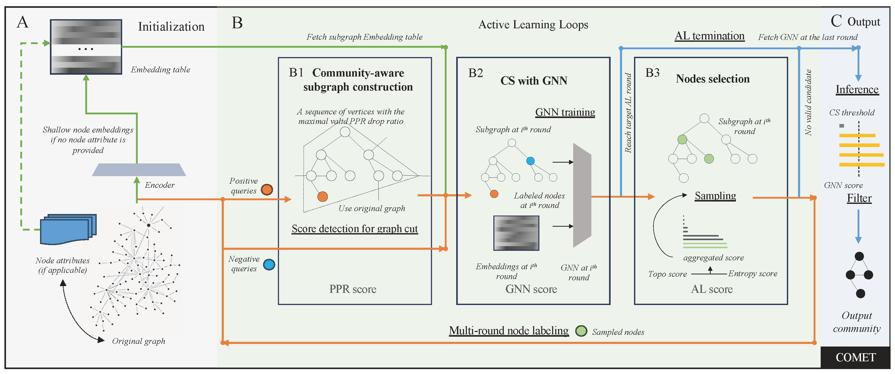

[](https://pubsonline.informs.org/journal/ijoc)

# COMET: An Interactive Framework for Efficient and Effective Community Search via Active Learning

This archive is distributed in association with the [INFORMS Journal on
Computing](https://pubsonline.informs.org/journal/ijoc) under the [MIT License](LICENSE).

## Cite

To cite the contents of this repository, please cite both the paper and this repo, using their respective DOIs.

https://doi.org/10.1287/ijoc.2024.0834
https://doi.org/10.1287/ijoc.2024.0834.cd

Below is the BibTex for citing this snapshot of the repository.
```
@misc{zhou2025comet,
  author =        {J. Zhou and K. Wang and J. Wang and K. Zhang and X. Lin},
  publisher =     {INFORMS Journal on Computing},
  title =         {COMET: An Interactive Framework for Efficient and Effective Community Search via Active Learning},
  year =          {2025},
  doi =           {10.1287/ijoc.2024.0834.cd},
  url =           {https://github.com/INFORMSJoC/2024.0834},
}  
```


## Overview

Community search (CS) is a fundamental problem in graph mining, where the goal is to find communities that are relevant to a given query. Traditional CS methods often struggle with scalability and effectiveness, especially when dealing with large graphs or complex queries.

To address these challenges, we introduce COMET, a novel interactive framework for community search that integrates active learning and graph neural networks (GNNs). COMET is designed to efficiently identify relevant communities in large graphs while minimizing user interaction.



Our objective is to identify query-driven cohesive subgraphs through a multi-round process. We leverage Personalized PageRank with GNN to develop a framework that achieves state-of-the-art performance on most community search benchmarks.

## Requirements

This code is tested under Python 3.10 (under conda) with following dependencies:
- `graph-tool` `numpy<2` `pytorch==1.12.0` (using conda to install)
- `scikit-learn` `networkx[default]` `torch_geometric` `cdlib` `metis` `datasketch` (using pip to install)
  - For `metis` (which is used for ablation study), you should also install
    ```bash
    sudo apt-get install libmetis-dev
    ```
- `pyg-lib` (used for generating Node2vec embedding)
  - If running with torch 1.12.0 with cuda 11.6 then simply run
    ```bash
    pip install pyg-lib -f https://data.pyg.org/whl/torch-1.12.0+cu116.html
    ```


Environment:
The experiments in our paper were conducted on an Ubuntu 22.04 system with two RTX 4090 GPUs (At least one GPU is required). All implementations are done in Python.


## code structure
```
.
├── auxiliary
├── baseline
├── dataset
├── experiments
├── ics
├── log
├── pics
├── preprocess
└── visualization
```


## Setup Instructions

- (in dataset folder) Download additional graph datasets (e.g., DBLP, YouTube, LiveJournal) from SNAP (https://snap.stanford.edu/data/index.html#communities). Amazon dataset along with four small datasets (Dolphins, Football, Karate, and EU-core) are already provided in the dataset folder for reference.
- (in experiments folder) Perform preprocessing (mainly to add Node2vec embedding to each dataset). Four small datasets (Dolphins, Football, Karate, and EU-core) are prepared for reference.
  ```bash
  sh exp_preprocess.sh
  ```
- Create log folder in the main directory.


## Running Evaluations

Main pipeline: Using the following script to perform community search for 8 datasets:
```bash
sh exp_comet_main.sh
```

**Key Parameters to Adjust in the Main Pipeline:**
- dataset: Dataset used for evaluation
- pos_num: Number of positive labels per community at the first round
- neg_num: Number of negative labels per community at the first round
- num_queries: Number of CS queries; can exceed the number of communities (sampling with replacement)
- damping: Damping factor for PPR
- epsilon: Epsilon for PPR
- al_method: Active learning method
- al_round: Number of active learning rounds
- model: Type of GNN model to use for node classification
- epochs: Number of training epochs for the GNN model
- learning_rate: Learning rate for the GNN model (default optimizer: Adam)
- hidden_layers: Number and size of hidden layers in the GNN model
- gnn_threshold: Classification threshold for the GNN model
- seed: Random seed
